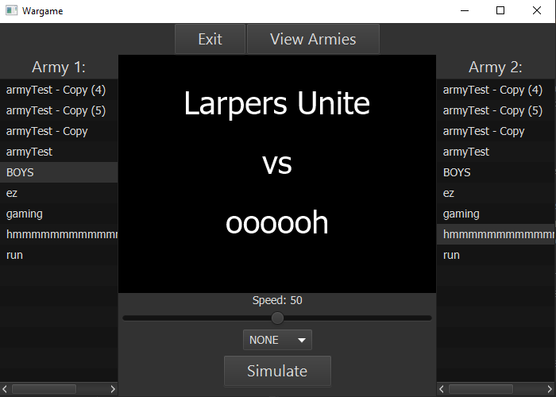
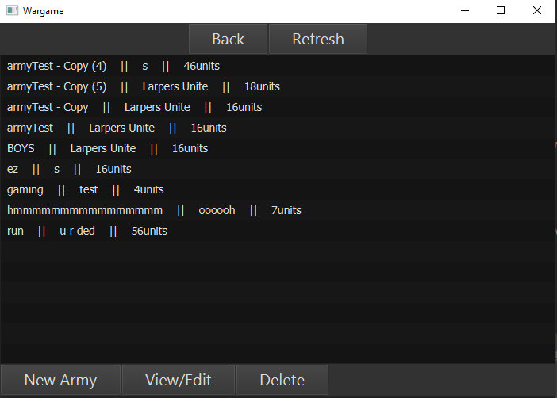
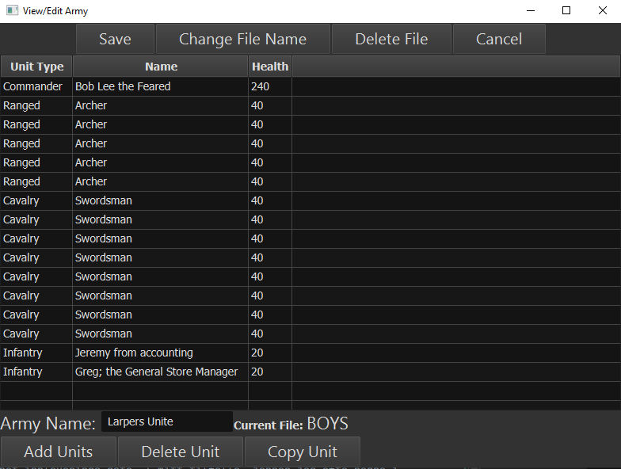

# Wargame Prosjekt

## Seksjoner

1. Innledning
2. Kravspesifikasjon
   1. Del 1
   2. Del 2
   3. Del 3
3. Design
4. Implementasjon
5. Prosess
6. Refleksjon
   1. Design
   2. Implementasjon
   3. Prosess
   4. Resultat
7. Konklusjon

## Innledning
Wargame Prosjektet er en del av vurdedingen for
[IDATG2001 Programmering 2](https://www.ntnu.no/studier/emner/IDATG2001#tab=omEmnet),
som består av en mappevurdering med flere deloppgaver.
I prosjektet skal det utvikles et program for å simulere slag mellom armeer av ulike typer enheter.
Programmet skal ha et brukergrensesnitt og kunne lagre flere armeer.

Prosjektet skal bruke enkelte praksiser fra emnet. Dette inkluderer;
* Maven Framework
* javaFX
* Lokal og global versjonskontroll
* Enhetstesting
* Unntakshåntering
* Design-mønstere

## Kravspesifikasjon
Oppgaven var gitt ut i 3 deler utover semesteret.
Hver del hadde rundt 4 del-oppgaver som ledet gjennom utviklingen av programmet.
Delene under beskriver kravene for hver av oppgavene.
Alle kravene er oppfylt av programmet/prosjektet.

* Enhetstesting
  * Enhetstester må opprettes for delen av koden som er sentralt for å oppfylle sentrale krav.
    Det er ikke nødvendig å utvikle enhetstester direkte knyttet til brukergrensesnittet,
    ettersom det ikke er tema i faget.
* Unntakshåndtering
  * Uønskede hendelser og tilstander som forstyrrer normal flyt skal håndteres på en god måte.
* Maven
  * Prosjektet skal være et Maven-prosjekt. (JDK 11 eller høyere) Filer lagres i standard oppsett.
* Versjonskontroll
  * Koden skal være koplet mot et sentralt repo.

### Del 1
* Maven og Git
  * Opprette et Maven-prosjekt med fornuftig group og artefact-ID.
    Det skal være mulig å bygge, teste og kjøre Maven uten feil.
  * Legge til prosjektet under lokal versjonskontroll.
    Hver av oppgavene skal ha minst ett commit som beskriver endringene på en kort og konsis måte.
    ".git" katalogen skal være med i innlevering.
* Superklassen Unit
  * Det skal opprettes en superklasse som representerer en enkel enhet.
    Den abstrakte klassen skal ha beskrivende egenskaper og enkelte metoder
    for å kalkulere et angrep mot en annen enhet.
* InfantryUnit, CavalryUnit, RangedUnit og CommanderUnit
  * Implementere spesialiserte typer enheter som bruker Unit som superklasse.
    De skal implementere abstrakte klasser for individuelle bonuser.
    Disse bonusene kan i enkelte tilfeller ha spesiel logikk.
* Army-klassen
  * En armé skal være en klasse for å samle og håndtere en liste med enheter.
    Klassen skal implementere metoder som blir brukbar for senere simulering/kamp.
* Simulering av et slag med klassen Battle
  * Implementere en klasse for å holde på to armeer og utføre en simulering.
    Tilfeldige enheter skal angripe hverandre og fjernes ved 0 hp, til en armé er tom.

### Del 2
* Versjonskontroll med git
  * Prosjektet skal underlegges et sentralt repo.
* Nye metoder i Army-klassen
  * Metodene skal kunne returnere alle enheter av en spesifik type, 
    ved bruk av streams og lambda-uttrykk.
* Filhåndtering
  * Det skal være mulig å lagre og lese en fil som skal følge et spesifkt format.
    Filtypen skal være ".csv" (Comma Seperated Values).
* GUI
  * Utarbeide skisser av et grafisk brukergrensesnitt med fornuftige og oversiktligeegenskaper.
    Grensesnittet skal implementeres i del 3.

### Del 3
* UnitFactory
  * Klassen skal anvende Factory design pattern med to metoder for å produsere enheter.
    Man skal kunne opprette en eller n antall enheter med type, navn og helseverdi.
* Terrain
  * Innføre terreng som variabel i utregningen til enhetene.
    Ulike terreng (hill, plains, forest) skal ha ulik effekt på de ulike enhets-typene.
* GUI
  * Implementere brukergrensesnitt skissene i javaFX ved bruk av FXML eller manuell kode.
    Man må også kunne velge terreng før man kjører simuleringen.
* Videre arbeid
  * Oppfordring for å være kreativ å implementere videre.

### Programmet / Brukstilfeller
På hver side i programmet er knapper for å navigere seg tilbake eller til en annen side.
Armé filer er inntil nå lagret under %HOME%/Documents/WargameArmies.
Denne lagrings-posisjonen kan ved nødvendighet endres i Controller klassen.
Programmet bruker et mørkt [stylesheet](https://github.com/joffrey-bion/javafx-themes/blob/master/css/modena_dark.css)
basert på [modena.css](https://gist.github.com/maxd/63691840fc372f22f470).

* Hovedside for simulering

  * Ved åpningen av programmet presenteres man med en hovedside der simuleringer av programmet pågår. 
  * Utvalg av armeer for simulering en gjort ved å klikke på to lister av lagrede filer på hver side av vinduet. 
  * I midten av vinduet blir utvalget presentert ved armé navnene i et canvas.
    Under er en gruppe med kontroller med egenskaper til å endre simulerings-hastigheten og terrenget.
    Når man klikker simuleringsknappen med 0 hastighet kjører den orginale simulerings-metoden
    og presenterer vinner-armeens navn til skjermen.
    Hvis en tidligere vinner er tilgjengelig vil en knapp være tilgjengelig for å åpne et vindu av den resterende
    armeen, som kan videre redigeres eller lagres.
    En vanlig simulering vil animeres der armeene plasseres tilfeldig på hver side der hver enhet nærmer seg og
    angriper den nærmeste fiendtlige enheten til en armé gjenstår.
---
* Arme oversikt

  * "View Armies" knappen tar deg til en side med liste av de tilgjengelige filene med armeer.
    Hver armé vises med filnavn, arménavn og antall enheter.
  * Om man gjør et utvalg av armé har man valg mellom å "Edit/View" eller "Delete".
    "Delete" sletter fila fra lagring. Knapper i programmet som har en effekt som er vanskelig å reversere
    skaper en dialog boks for å forsikre valget.
    "Edit/View" kan alternativt brukes ved å dobbelklikke på en armé i lista, 
    dette åpner et seperat vindu som viser armeén.
    "New Army" knappen vil først spørre deg om et filnavn, for så å opprette ett nytt "armé-vindu" med en tom armé.
---
  * Armé vindu

    
    * Armé vinduet har en tilknyttet armé og filnavn. Øverst har du valg mellom knappene
      "Save", "Change File Name", "Delete File" og "Cancel", alle med responsive dialoger.
      Ending av filnavnet gjør det mulig å lage en kopi av armeen.
    * Tabellen i midten er sorterbar etter enhetens type, navn og helse.
      Armé navnet kan endres mot bunnen av vinduet.
    * "Delete Unit" og "Copy Unit" påvirker den for øyeblikkede valgte enheten.
      Disse knappene forårsaker ikke dialoger for å gjøre redigering av armeen lettere,
      med mindre ingen enheter er utvalg, da gis en advarsel til brukeren.
      "Add Units" knappen åpner en dialog med utvalget for en UnitFactory.
    * Ameer åpnes i et seperat vindu for å kunne arbeide med flere armeer og simulering samtidig.
      "Save" knappen oppdaterer relevante lister i hovedvinduet ved å utnytte Observer mønsteret.

---

## Design

## Implementasjon

## Prosess
Gjennom prosjektet har jeg jobbet i lengre intervaller i nærheten av innleveringsfrist,
etter mest relevant stoff i emnet var gjennomgått.
Mot del 3 tok jeg i bruk
[GitLabs kanban-tavle](https://git.gvk.idi.ntnu.no/course/idatg2001/idatg2001-2022-ws/sondesp/wargame3/-/boards).
Dette var praktisk for å holde styr på hvilke ting som måtte bli gjort, og hvilke som var fokusert.
Regelmessige commits gjorde også at jeg oftere fokuserte på en implementering om gangen.

Emnets forelesninger var den viktigste ressursen, selv om jeg oftest ikke møtte opp fysisk.
Presentasjonene forklarte bra bort konseptene og om jeg hadde spørsmål om implementeringen,
så jeg videre på demoene.
Enkelte nettsider var praktiske i dette spesifikke prosjektet;
* [Baeldung](https://www.baeldung.com/javafx) for ulike javaFX ressurser
* [Stack overflow](https://stackoverflow.com/), spesielt for problemer relatert til Thread implementering
* [JavaFX API](https://docs.oracle.com/javase/8/javafx/api/javafx/stage/Window.html)

## Refleksjon
### Design

### Implementasjon
I det andre utviklingsprosjektet vårt dette semesteret, der vi var 3 på gruppa,
ble arbeidsmengden delt inn i "model-controller-view" fordelt på vært medlem.
I dette tilfelle fikk jeg ansvaret for modellen og lite erfaring med javaFX delen av programmet.
Dette resulterer i at jeg er komfortabel med model-bygging og filhåndtering for ".csv",
men lite kjenskap til javaFX.
I prosjektet valgte jeg derfor å skrive javaFX manuelt i stedet for å bruke FXML,
for å bedre få erfaring med oppbygningen av strukturene av en applikasjon.
Dette valget resulte i at enkelte funksjonaliteter er dårligere implementert, og svekker coupling og coheision.
Enkelte klasser kunne vært bedre abstrahert,
og det er en synlig forskjell mellom strukturen i modellen og resten av programmet.

Likevel føler jeg funksjonaliteten ble bra;
* Implementasjonen av "observere" ved lister gjør at man flexibelt teste armé-simuleringer
  samtidig som man redigerer armeene.
* Oppdateringen av vindu-elementer.
  * Hovedvinduet roterer mellom bruk av to klasser som utvider BorderPane,
    slik at du kan bytte mellom å jobbe mellom to arbeidsområder.
  * BattlePane, som holder på elementene for simulerings-vinduet, hadde en tendens til å bli komplisert,
    ettersom simulerings knappene ikke ville oppdattere seg i tilfelle det ble kalt fra en annen thread.
* Simulasjonen var en feature jeg tidlig hadde lyst til å implementere.
  Den bruker hovedsakelig kunnskap fra [javascript prosjekter](https://folk.ntnu.no/sondesp/) jeg har gjort,
  den tidligere kortstokk oppgaven vi hadde, samt informasjon jeg fant om threads.

### Prosess
#### "Du dømmer ikke din nestes commit tider"
Gjennom prosjektet utførte jeg oppgavene i nærhet innleverings-dato.
Jeg har en tendens til å sette meg ned og programmere i lange intervaller for å holde meg målrettet og interessert
i problemløsningen, som blir gunstigere med tidsbegrensning.
De klare svakhetene ved denne prosessen er hjernen får mindre mulighet til å hvile,
som kan gjøre egenskapen for problemløsning værre.
Ofte er det gunstig å ta et pause fra et problem, hjernen får hvile og problemet kan bli sett fra nye vinkler.

#### Bruk av forelesninger
Jeg føler personlig jeg ofte jobber med ny informasjon bedre når jeg søker det ut og bearbeider det aktivt
gjennom problemløsning.
Samt, med en opplastet forelesning er det ofte mulig å uthente viktig informasjon fortere.
Baksiden med dette er at man kan gå glipp av informasjon som kan forårsake unødvendige "troubleshooting"
i utviklingen, og det er derfor viktig å praktisere og få erfaring konseptene.
I tilfelle av vårt fag, var forelesningene og opplastningene av dem, grunnet en dyktig foreleser/emneansvarlig,
veldig oversiktlig strukturert. Nødvendig informasjon var altså lett tilgjengelig i etterkant.
Som mål til neste semester skal jeg uansett prøve å møte opp mer for en mer utfylt læringsopplevelse.

### Resultat

## Konklusjon
